# 🛺 Dhaka Tesla Pool

**Share a seat. Split the fare. Survive Dhaka traffic.**

Dhaka Tesla Pool is a ride-pooling web app for Dhaka. Passengers request a ride, the system groups people who are travelling along the same road in the same direction, a driver accepts the group, and everyone pays their own fair fare. A "Tesla" is a painted three-seat rickshaw used by the system as a ride-pooling vehicle.

| | |
|---|---|
| **Live app** | https://dhk-tesla-pool.vercel.app/ |
| **API** | https://dhaka-tesla-pool-tn1t.onrender.com/api/v1 |
| **Demo video (6 min)** | https://youtu.be/UxW8jUHLrZo?si=ZqiWpuhJSgu-yBKk |

> **Heads-up:** the API runs on Render's free tier. After 15 minutes idle it sleeps, and the first request can take about a minute to wake it. The demo data is re-seeded on every wake-up, so the app always starts in a clean, known state.

### Demo credentials

Every demo account uses the same password: **oi_mama_jaben@123**. The login pages also have one-click "demo account" cards.

| Role | Name | Email |
|---|---|---|
| Driver | Jashim (owns **Bullet**, 3 seats) | jashim@dhakateslapool.test |
| Driver | Kuddus (owns **Thunder**, 3 seats) | kuddus@dhakateslapool.test |
| Passenger | Nusrat | nusrat@dhakateslapool.test |
| Passenger | Rafiq | rafiq@dhakateslapool.test |
| Passenger | Shirin | shirin@dhakateslapool.test |
| Passenger | Moshee-Ur | mosheeur@dhakateslapool.test |
| Passenger | Mehek | mehek@dhakateslapool.test |
| Passenger | Alice | alice@dhakateslapool.test |

### Try it in two minutes

1. **Nusrat** requests **Mohakhali → Gulshan 1**. Watch the map and the fare estimate.
2. **Rafiq** (another browser or incognito window) requests **Gulshan 1 → Gulshan 2**. The two trips form one straight line, so they are grouped and both fares drop by 20%.
3. **Shirin** requests **Gulshan 1 → Mohakhali**. It is the opposite direction, so she gets a separate group.
4. **Jashim** sees both groups, opens the details, and accepts the Nusrat + Rafiq group. Walk the trip stop by stop and watch Nusrat's and Rafiq's screens update.
5. **Kuddus** sees the same groups until Jashim accepts one. Then it disappears for Kuddus, or shows "just accepted by another driver".

---

## Table of contents

1. [Summary](#1-summary)
2. [Problem statement](#2-problem-statement)
3. [Features implemented](#3-features-implemented)
4. [Screenshots](#4-screenshots)
5. [Architecture](#5-architecture)
6. [Use cases overview](#6-use-cases-overview)
7. [Ride and pool lifecycle](#7-ride-and-pool-lifecycle)
8. [Automatic matching](#8-automatic-matching)
9. [Fare model](#9-fare-model)
10. [Concurrency: the last-seat problem](#10-concurrency-the-last-seat-problem)
11. [Database design](#11-database-design)
12. [Tech stack and justification](#12-tech-stack-and-justification)
13. [Project structure](#13-project-structure)
14. [Prerequisites](#14-prerequisites)
15. [Environment variables](#15-environment-variables)
16. [Setup and running](#16-setup-and-running)
17. [API overview](#17-api-overview)
18. [Testing](#18-testing)
19. [Deployment](#19-deployment)
20. [Git workflow](#20-git-workflow)
21. [Key decisions and trade-offs](#21-key-decisions-and-trade-offs)
22. [Known limitations](#22-known-limitations)
23. [Next improvements](#23-next-improvements)
24. [If Oi Tesla Goes Viral](#24-if-oi-tesla-goes-viral)
25. [AI usage](#25-ai-usage)
26. [Author](#26-author)

---

## 1. Summary

Dhaka Tesla Pool is a full-stack MVP with two actors: **Passenger** and **Driver**, with **Ride**, **Pool** and **Tesla** as core system entities.

- Passengers pick a pickup and a destination on an interactive map of Dhaka. The app shows the shortest path, the distance, and the estimated fare.
- The system **automatically groups** passengers whose trips merge into one straight line of travel. Each passenger gets an individual fare.
- Drivers see every open group, inspect the details, and **accept** one. Only accepting locks it.
- The driver moves the trip forward step by step (arrived, started, next stop, completed). Passengers see the same progress on the same map.
- Seat capacity, valid status changes, and "one active trip per vehicle" are enforced **inside the database**, so they hold even under concurrent requests.

## 2. Problem statement

In Dhaka, many people travel the same road at the same time, but each person takes a separate ride. That means higher cost for everyone and more traffic on the road.

The product problem is:

- Nusrat wants to go somewhere. Rafiq wants to go somewhere nearby. Jashim's Bullet has three seats.
- Passengers should be able to request a ride and share a Tesla with someone else *when it makes sense*.
- The driver must see who is riding and what stage the trip is at.
- Each passenger must see **their own** fare and status, not anyone else's.
- After a ride, the system must keep enough history to explain what happened.

"When it makes sense" is the hard part. My answer is a strict matching rule (see [Automatic matching](#8-automatic-matching)): passengers can share only if one vehicle can serve all of them along **one line, in one direction**.

## 3. Features implemented

**Passenger**
- Sign up and log in (JWT). One-click demo accounts on the login page.
- Interactive Dhaka map: choose pickup and destination, see the highlighted shortest path, distance, and estimated pooled fare.
- Request a ride for 1–3 seats. Riders are grouped automatically.
- Live ride status with a journey progress bar and a shared route map. Each rider has their own colour.
- "You're riding with ..." card, plus the other riders' paths (other riders' fares are never shown).
- Cancel before the trip starts. A cancelled seat is freed and the route and fares are recalculated.
- Pay with **cash** or simulated **TeslaPay**.
- Ride history with a status filter.

**Driver**
- Sign up, log in, register a Tesla (name, model, plate, capacity 1–3), go online or offline.
- See **every** open ride group. Viewing never locks a group.
- **Accept** a group (atomic claim: the first driver wins, the second gets a clean 409).
- Ride page with seat view, combined route map (dotted = road ahead, solid green = road covered), a stop-by-stop timeline, each passenger's path, distance and fare, and the total fare.
- Trip controls: arrived at pickup, start trip, arrived at next stop, complete trip, cancel.
- Past rides list.

**System**
- Dijkstra shortest path on a weighted Dhaka zone graph.
- Path-merge matching (one line, one direction, no repeated stop).
- Fare per passenger with an automatic pool discount that is recalculated when riders join or leave.
- Database-enforced seat capacity (row lock), legal status transitions, role checks, and one active pool per vehicle.
- Rate limiting on auth routes, Helmet headers, Zod validation on every input, consistent JSON errors.

**Experience**
- A "Dhaka rickshaw art" interface: painted colour palette, Bullet the mascot, Framer Motion transitions, a searching sequence, and full prefers-reduced-motion support.

## 4. Screenshots

| | |
|---|---|
| 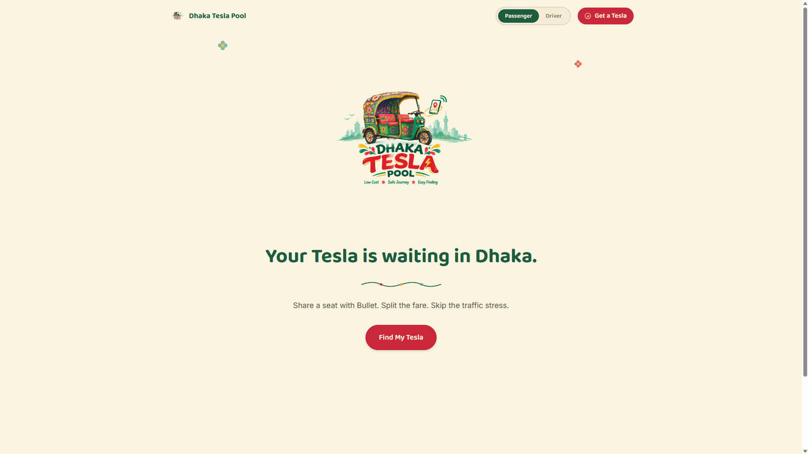<br/>**Landing** | 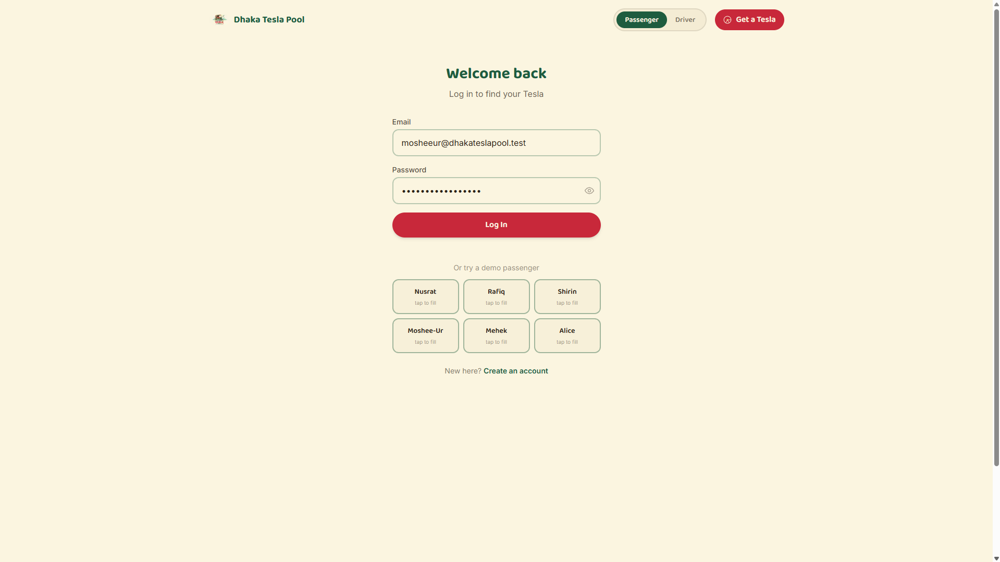<br/>**Login with demo accounts** |
| 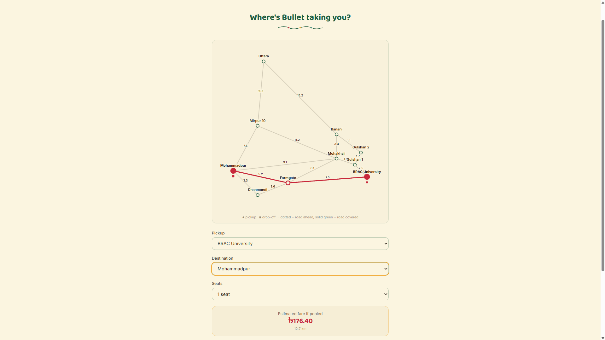<br/>**Request a ride: shortest path and fare** | 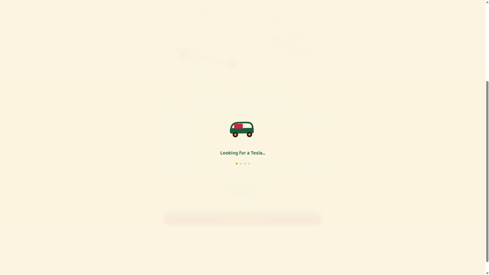<br/>**Searching for a Tesla** |
| 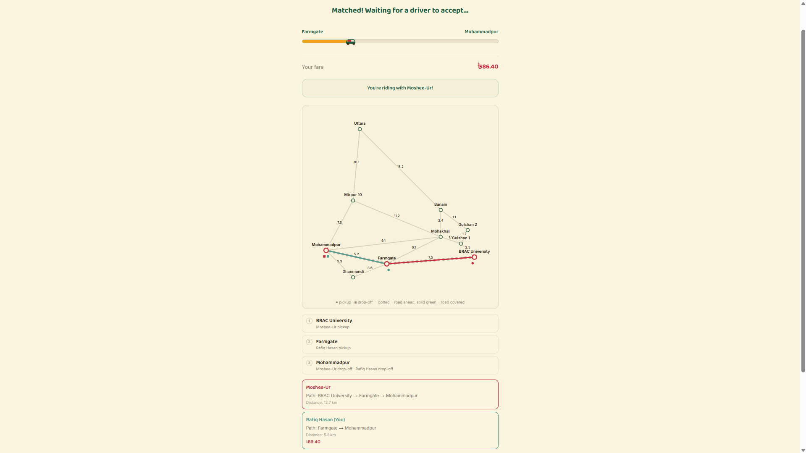<br/>**Passenger view of a shared ride** | 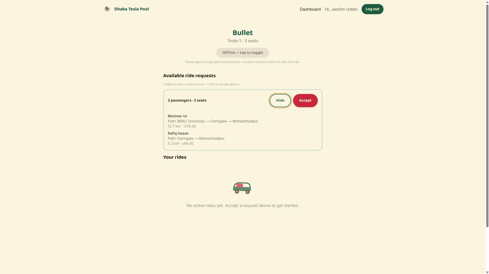<br/>**Driver: open ride groups** |
| 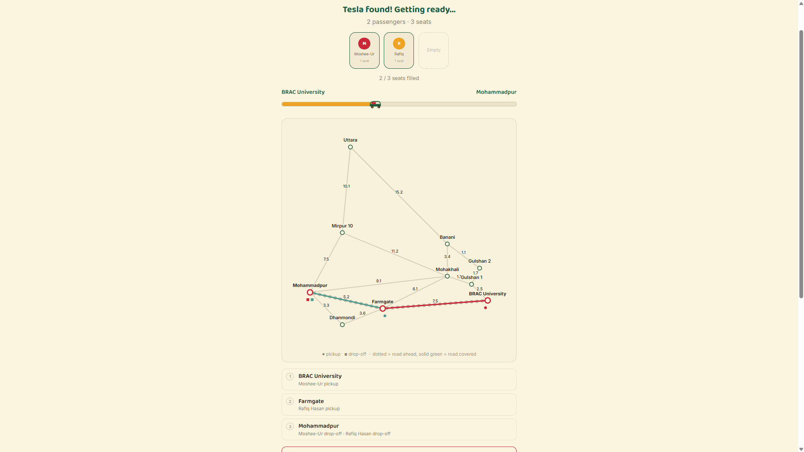<br/>**Driver: accepted ride details** | 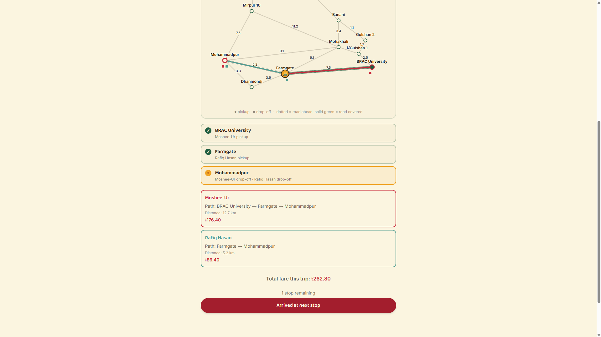<br/>**Trip in progress** |
| 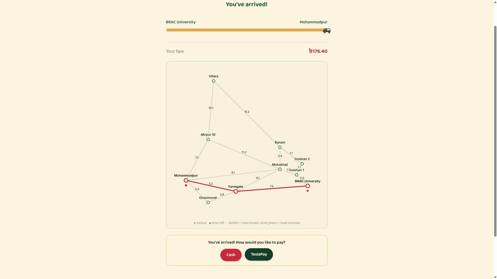<br/>**Payment** | 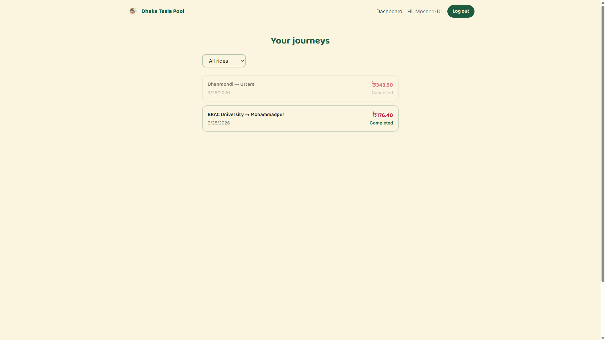<br/>**Ride history** |
| 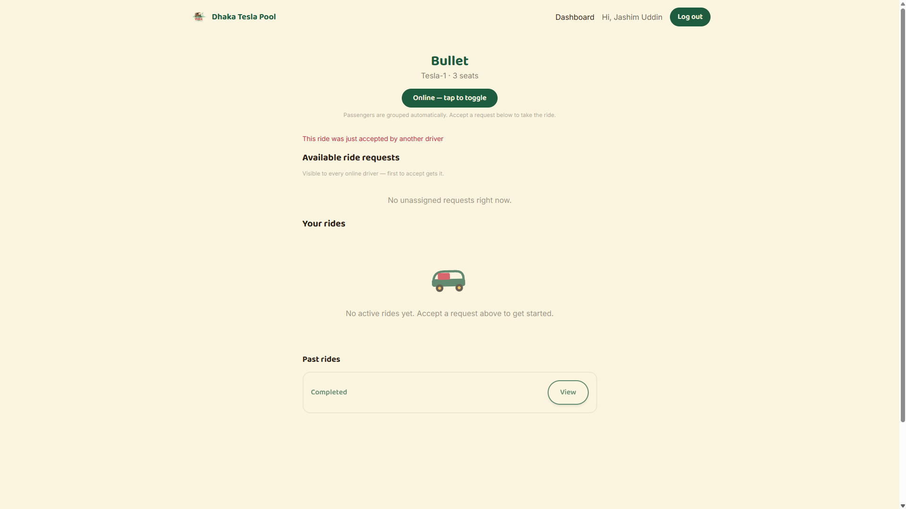<br/>**Two drivers, one group: first accept wins** | 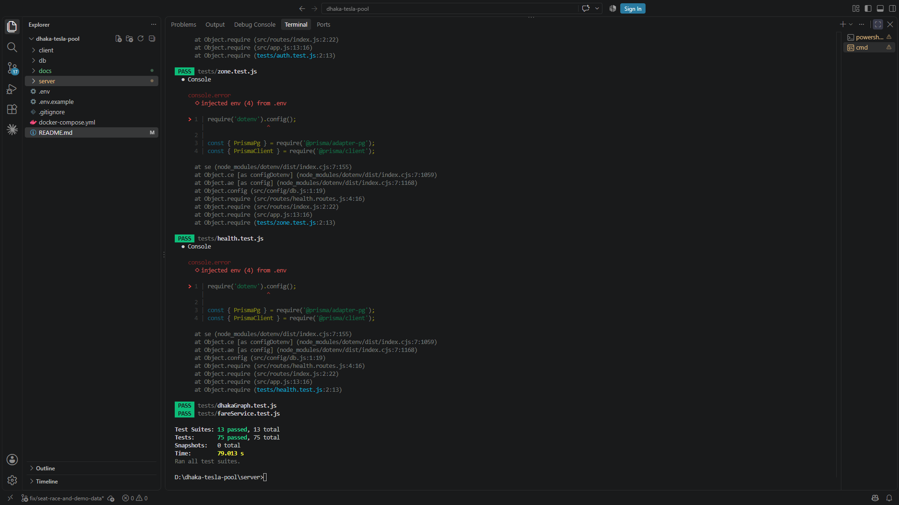<br/>**Tests passing** |

## 5. Architecture

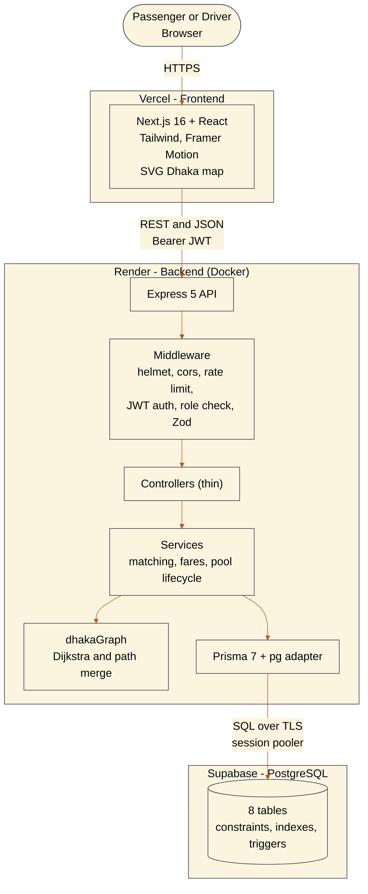
```mermaid
%%{init: {'theme':'base','themeVariables': {'background':'#FBF5E0','mainBkg':'#FBF5E0','primaryColor':'#FBF5E0','secondaryColor':'#FBF5E0','tertiaryColor':'#FBF5E0','clusterBkg':'#FBF5E0','primaryBorderColor':'#333333','clusterBorder':'#333333','primaryTextColor':'#000000','textColor':'#000000','lineColor':'#C05621','edgeLabelBackground':'#FBF5E0','nodeBorder':'#333333','fontSize':'20px'}}}%%
flowchart TB
    User(["Passenger or Driver<br/>Browser"]) -->|HTTPS| Web

    subgraph Vercel["Vercel - Frontend"]
        Web["Next.js 16 + React<br/>Tailwind, Framer Motion<br/>SVG Dhaka map"]
    end

    Web -->|"REST and JSON<br/>Bearer JWT"| API

    subgraph Render["Render - Backend (Docker)"]
        API["Express 5 API"] --> MW["Middleware<br/>helmet, cors, rate limit,<br/>JWT auth, role check, Zod"]
        MW --> CTRL["Controllers (thin)"]
        CTRL --> SVC["Services<br/>matching, fares, pool lifecycle"]
        SVC --> GRAPH["dhakaGraph<br/>Dijkstra and path merge"]
        SVC --> PRISMA["Prisma 7 + pg adapter"]
    end

    PRISMA -->|"SQL over TLS<br/>session pooler"| DB

    subgraph Supabase["Supabase - PostgreSQL"]
        DB[("8 tables<br/>constraints, indexes, triggers")]
    end
```

**Request flow.** The browser calls the Next.js app. The app calls the Express API with a JWT. The API validates input (Zod), checks the user and role, and runs business rules in a service. Prisma reads and writes PostgreSQL. The database has the final say on capacity and status changes.

**Backend organisation (MVC adapted to a REST API).**
- **Model:** the Prisma schema and client over PostgreSQL.
- **View:** the JSON response ({ success, message, data } or { success: false, message, errors }).
- **Controller:** thin handlers that only parse the request and shape the response.
- **Service:** business rules such as matching, fares, and the pool lifecycle. Controllers never contain rules.

**Local development** uses Docker Compose with three containers: postgres (schema loaded from db/init/01-schema.sql), api (seeds demo data, then serves on port 4000), and web (Next.js on port 3000).

## 6. Use cases overview

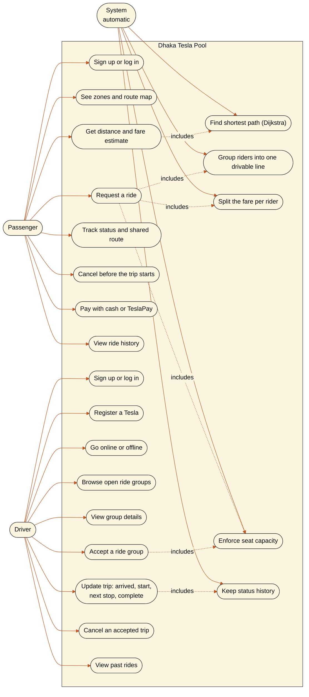
```mermaid
%%{init: {'theme':'base','themeVariables': {'background':'#FBF5E0','mainBkg':'#FBF5E0','primaryColor':'#FBF5E0','secondaryColor':'#FBF5E0','tertiaryColor':'#FBF5E0','clusterBkg':'#FBF5E0','primaryBorderColor':'#333333','clusterBorder':'#333333','primaryTextColor':'#000000','textColor':'#000000','lineColor':'#C05621','edgeLabelBackground':'#FBF5E0','nodeBorder':'#333333','fontSize':'16px'}}}%%
flowchart LR
    P(["Passenger"])
    D(["Driver"])
    SYS(["System<br/>automatic"])

    subgraph APP["Dhaka Tesla Pool"]
        P1(["Sign up or log in"])
        P2(["See zones and route map"])
        P3(["Get distance and fare estimate"])
        P4(["Request a ride"])
        P5(["Track status and shared route"])
        P6(["Cancel before the trip starts"])
        P7(["Pay with cash or TeslaPay"])
        P8(["View ride history"])

        D1(["Sign up or log in"])
        D2(["Register a Tesla"])
        D3(["Go online or offline"])
        D4(["Browse open ride groups"])
        D5(["View group details"])
        D6(["Accept a ride group"])
        D7(["Update trip: arrived, start,<br/>next stop, complete"])
        D8(["Cancel an accepted trip"])
        D9(["View past rides"])

        S1(["Find shortest path (Dijkstra)"])
        S2(["Group riders into one drivable line"])
        S3(["Split the fare per rider"])
        S4(["Enforce seat capacity"])
        S5(["Keep status history"])
    end

    P --> P1 & P2 & P3 & P4 & P5 & P6 & P7 & P8
    D --> D1 & D2 & D3 & D4 & D5 & D6 & D7 & D8 & D9
    SYS --> S1 & S2 & S3 & S4 & S5

    P3 -.->|includes| S1
    P4 -.->|includes| S2
    P4 -.->|includes| S3
    P4 -.->|includes| S4
    D6 -.->|includes| S4
    D7 -.->|includes| S5
```

## 7. Ride and pool lifecycle

A **pool** is one shared trip: one vehicle, one combined route, up to three seats. Every ride belongs to a pool.

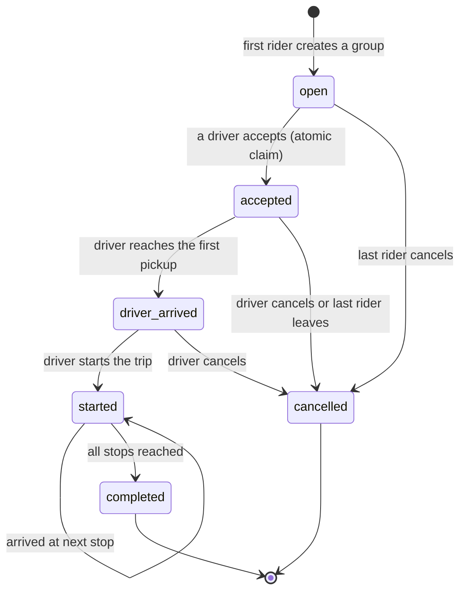
```mermaid
stateDiagram-v2
    [*] --> open: first rider creates a group
    open --> accepted: a driver accepts (atomic claim)
    open --> cancelled: last rider cancels
    accepted --> driver_arrived: driver reaches the first pickup
    accepted --> cancelled: driver cancels or last rider leaves
    driver_arrived --> started: driver starts the trip
    driver_arrived --> cancelled: driver cancels
    started --> started: arrived at next stop
    started --> completed: all stops reached
    completed --> [*]
    cancelled --> [*]
```

**Ride status** follows the pool: requested → matched → accepted → driver_arrived → started → completed, with cancelled allowed until the trip starts.

- A ride becomes matched the moment it joins a pool (database trigger).
- When a pool changes status, a trigger pushes the new status down to every rider's ride and membership, so a passenger and the driver can never disagree.
- The brief suggested MATCHED/ACCEPTED as one step. I split it into two: **matched** means "grouped with riders", **accepted** means "a driver has taken the group". The split matters because riders can be matched for a while before any driver accepts.
- Stage timestamps (matched_at, accepted_at, driver_arrived_at, started_at, completed_at, cancelled_at) are set automatically by triggers.

## 8. Automatic matching

**Rule.** Two or more passengers can share a vehicle only if their paths merge into **one straight line, travelling in one direction, with no repeated stop**. The rule is implemented as tryMergePath in server/src/data/dhakaGraph.js.

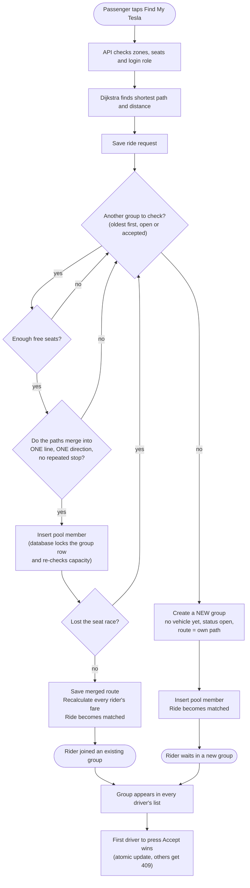
```mermaid
flowchart TD
    A(["Passenger taps Find My Tesla"]) --> B["API checks zones, seats and login role"]
    B --> C["Dijkstra finds shortest path and distance"]
    C --> D["Save ride request"]
    D --> E{"Another group to check?<br/>(oldest first, open or accepted)"}
    E -- no --> N["Create a NEW group<br/>no vehicle yet, status open,<br/>route = own path"]
    E -- yes --> F{"Enough free seats?"}
    F -- no --> E
    F -- yes --> H{"Do the paths merge into<br/>ONE line, ONE direction,<br/>no repeated stop?"}
    H -- no --> E
    H -- yes --> I["Insert pool member<br/>(database locks the group row<br/>and re-checks capacity)"]
    I --> J{"Lost the seat race?"}
    J -- yes --> E
    J -- no --> K["Save merged route<br/>Recalculate every rider's fare<br/>Ride becomes matched"]
    N --> M["Insert pool member<br/>Ride becomes matched"]
    K --> Z1(["Rider joined an existing group"])
    M --> Z2(["Rider waits in a new group"])
    Z1 --> V["Group appears in every driver's list"]
    Z2 --> V
    V --> W["First driver to press Accept wins<br/>(atomic update, others get 409)"]
```

**Examples** (paths come from Dijkstra on the graph below):

| Rider A | Rider B | Result | Why |
|---|---|---|---|
| Mohakhali → Gulshan 1 | Gulshan 1 → Gulshan 2 | Grouped: Mohakhali → Gulshan 1 → Gulshan 2 | B starts where A ends, so it is one line |
| Mohammadpur → Gulshan 1 | Mohakhali → Gulshan 1 | Grouped | B's path sits inside A's path |
| Mohakhali → Gulshan 1 | Gulshan 1 → Mohakhali | Separate | Opposite direction |
| Mohammadpur → BRAC University | Dhanmondi → BRAC University | Separate | Different pickups that fork, so no single line serves both |
| Banani → Mohakhali | Banani → Gulshan 1 | Separate | Both leave Banani but go in different directions (the brief's own pair) |

**Why not "share at least one road"?** My first version matched riders who shared any road segment. That was wrong: two riders can share a road and still arrive from, or leave towards, different places. A driver drives one path, so I changed the rule to "one merged line".

**Who assigns the driver?** Passenger grouping is automatic. Driver assignment is a human choice: every driver sees every open group, and only **Accept** locks it. This is better for drivers, who can inspect the route first.

### Route graph

The map is a weighted undirected graph. Weights are distances in km. Coordinates only decide where each zone is *drawn*. Distances always come from the edge weights.

| Zone A | Zone B | km | | Zone A | Zone B | km |
|---|---|---|---|---|---|---|
| Uttara | Mirpur 10 | 10.1 | | Farmgate | BRAC University | 7.5 |
| Mirpur 10 | Mohammadpur | 7.5 | | BRAC University | Gulshan 1 | 2.5 |
| Mohammadpur | Farmgate | 5.2 | | Mohakhali | Gulshan 1 | 1.5 |
| Mohammadpur | Dhanmondi | 3.3 | | Gulshan 1 | Gulshan 2 | 1.7 |
| Mohammadpur | Mohakhali | 9.1 | | Gulshan 2 | Banani | 1.1 |
| Dhanmondi | Farmgate | 3.6 | | Banani | Uttara | 15.2 |
| Farmgate | Mohakhali | 6.1 | | Banani | Mohakhali | 3.4 |
| Mirpur 10 | Mohakhali | 11.2 | | | | |

### Combined route and progress

Each pool stores its merged route in pools.spine (a JSON list of zone codes). The stops (each rider's pickup and drop-off) are ordered along the spine. At the same stop, drop-offs come before pickups so seats are freed first. current_stop_index records how far the vehicle has travelled. The driver advances it one stop at a time, and the map, timeline and passenger screens all read it.

## 9. Fare model

```
distanceCharge = round( 1500 paisa × distanceKm × seats )   (৳15.00 per km per seat)
subtotal       = 3000 paisa + distanceCharge                (৳30.00 base fare)
poolDiscount   = pooled ? round( subtotal × 20% ) : 0
passengerFare  = subtotal − poolDiscount
```

A pool counts as "pooled" when it has more than one active rider. Fares are recalculated for **every** rider whenever someone joins or leaves, so the discount never depends on who joined first.

**Hand-check 1 (unit test).** 2 km, 1 seat: subtotal = 3000 + 3000 = 6000. Pooled: 6000 − 1200 = **4800 paisa (৳48.00)**.

**Hand-check 2 (story cast).**

| Rider | Trip | Distance | Subtotal | Solo fare | Pooled fare |
|---|---|---|---|---|---|
| Nusrat | Mohakhali → Gulshan 1 | 1.5 km | 3000 + 2250 = 5250 | ৳52.50 | 5250 − 1050 = **4200 (৳42.00)** |
| Rafiq | Gulshan 1 → Gulshan 2 | 1.7 km | 3000 + 2550 = 5550 | ৳55.50 | 5550 − 1110 = **4440 (৳44.40)** |

Together they pay ৳86.40 instead of ৳108.00, and each fare is calculated on their own distance.

**How money is stored.** As **integer paisa** in BIGINT columns, never floating point, so there are no rounding surprises when adding or splitting money. Prisma returns BIGINT as JavaScript BigInt, so the API sends money fields as numeric strings. Payment is simulated (cash or TeslaPay). No real gateway is used.

## 10. Concurrency: the last-seat problem

> Bullet has one seat left. Nusrat and Shirin both try to claim it at nearly the same instant. Both initially see one seat available.

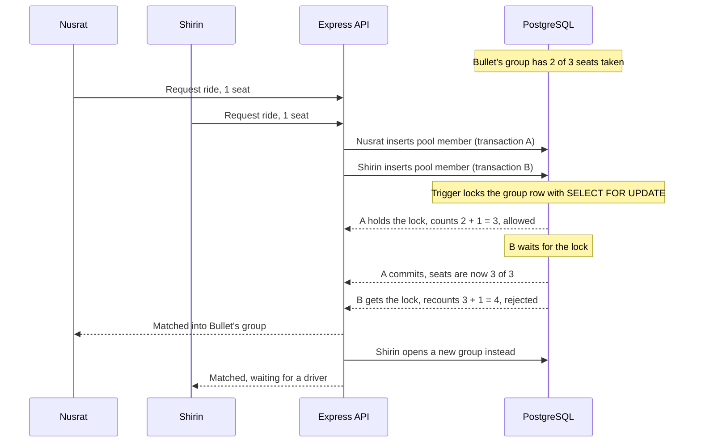
```mermaid
sequenceDiagram
    participant N as Nusrat
    participant S as Shirin
    participant API as Express API
    participant DB as PostgreSQL

    Note over DB: Bullet's group has 2 of 3 seats taken
    N->>API: Request ride, 1 seat
    S->>API: Request ride, 1 seat
    API->>DB: Nusrat inserts pool member (transaction A)
    API->>DB: Shirin inserts pool member (transaction B)
    Note over DB: Trigger locks the group row with SELECT FOR UPDATE
    DB-->>API: A holds the lock, counts 2 + 1 = 3, allowed
    Note over DB: B waits for the lock
    DB-->>API: A commits, seats are now 3 of 3
    DB-->>API: B gets the lock, recounts 3 + 1 = 4, rejected
    API-->>N: Matched into Bullet's group
    API->>DB: Shirin opens a new group instead
    API-->>S: Matched, waiting for a driver
```

**How it is handled now (three layers)**

1. **Seat capacity is checked in the database, under a row lock.** The validate_pool_capacity trigger runs SELECT ... FOR UPDATE on the pool row, then counts the *other* active seats and rejects any overflow. Two concurrent inserts are serialised by the lock, so the second one sees the true count. The app also pre-checks seats for speed, but the database is the referee.
2. **The loser is not an error.** If the trigger rejects a rider, the service catches that specific conflict and tries the next group. If none fits, it opens a new group. Nobody is dropped.
3. **Driver claims are atomic.** Accept is one UPDATE ... WHERE vehicle_id IS NULL AND status = 'open'. Only the first driver changes a row. The second gets count = 0 and a clean **409**. A partial unique index (one_active_pool_per_vehicle) also stops one Tesla from running two active pools.

**Proof:** server/tests/poolCapacity.test.js fires two simultaneous ride requests for the last seat and asserts that total seats never pass 3, both riders are placed, and exactly one wins the seat.

**What I would change at scale**
- Move matching out of the request path into workers that consume a queue partitioned by **geographic cell**. That gives one writer per area, so hot pools stop contending on row locks.
- Add optimistic concurrency (a version column) or pg_advisory_xact_lock per pool for the read-modify-write on the route.
- Add idempotency keys on ride creation, so retries never create duplicates.
- Keep the database constraint as the last line of defence.

## 11. Database design

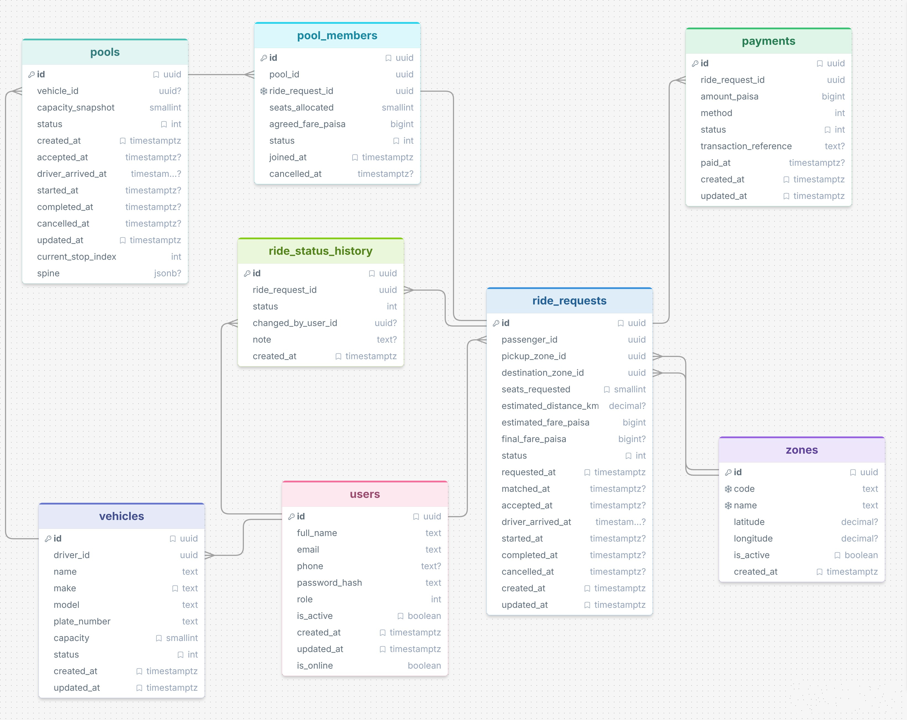

The schema is PostgreSQL. db/init/01-schema.sql is the single source of truth.

### Tables

| Table | Purpose | Key columns and rules |
|---|---|---|
| users | Passengers and drivers | role enum; email unique **case-insensitively** (LOWER(email) index); phone unique when present; password_hash (bcrypt); is_active; is_online (drivers) |
| zones | The 10 Dhaka areas (graph nodes) | code and name unique; latitude/longitude are repurposed as map x/y drawing coordinates |
| vehicles | A driver's Tesla | driver_id FK (trigger checks the owner is a driver); plate unique case-insensitively; capacity CHECK 1–3; status enum |
| ride_requests | One passenger's request | Pickup and destination FKs with CHECK (must differ); seats_requested CHECK 1–3; estimated_fare_paisa, final_fare_paisa (BIGINT, non-negative); status enum plus a timestamp for every stage |
| pools | One shared trip (one combined route) | vehicle_id is **nullable** until a driver accepts; capacity_snapshot (the vehicle's capacity at acceptance, so history stays true if the vehicle changes); status enum; spine JSONB (merged route); current_stop_index |
| pool_members | Links a ride to its pool | ride_request_id **unique** (a ride is in at most one pool); seats_allocated CHECK 1–3; agreed_fare_paisa (source of truth for the fare); status (active, completed, cancelled) |
| ride_status_history | Audit log | Append-only rows with ride_request_id, status, changed_by_user_id, note |
| payments | One payment per ride | ride_request_id **unique**; amount_paisa; method (cash, teslapay); status; unique transaction_reference when present |

### Relationships

- users 1 — N vehicles (a driver owns vehicles)
- users 1 — N ride_requests (a passenger makes requests)
- zones 1 — N ride_requests (twice: pickup and destination)
- vehicles 1 — N pools (a vehicle runs many pools over time, but only one active at a time)
- pools 1 — N pool_members
- ride_requests 1 — 1 pool_members
- ride_requests 1 — N ride_status_history
- ride_requests 1 — 1 payments

### Rules enforced by the database

| Rule | What it does |
|---|---|
| validate_pool_capacity (trigger) | Row-locks the pool and rejects seat overflow, including under concurrency |
| validate_ride_status_transition, validate_pool_status_transition (triggers) | Allow only legal status moves and stamp stage timestamps |
| mark_ride_matched_on_pool_join (trigger) | A ride becomes matched when it joins a pool |
| cascade_pool_status_to_members (trigger) | Pool status changes flow to every rider's ride and membership |
| sync_ride_final_fare (trigger) | Copies the agreed fare onto the ride |
| validate_vehicle_driver, validate_ride_passenger (triggers) | Only drivers own vehicles, only passengers request rides |
| one_active_pool_per_vehicle (partial unique index) | One non-finished pool per vehicle |
| CHECK constraints | Capacity and seats within 1–3, money ≥ 0, pickup ≠ destination |
| Indexes | On status, passenger, zones, vehicle, pool, membership, history and payment columns for the main queries |

**Row Level Security is intentionally off.** The Express API is the only database client and connects with a privileged role that bypasses RLS anyway. Enabling RLS with no policies would just block everything. Access control lives in the API (JWT, role checks, ownership checks).

## 12. Tech stack and justification

| Layer | Picked | Alternatives | Why it fits this MVP | Switch when |
|---|---|---|---|---|
| Frontend | **Next.js 16** (App Router) + React, **Tailwind v4** | Plain React + router, CSS modules, MUI | Required by the brief. Tailwind makes a fully custom "painted" look quick, without fighting a component library | A large team needs a shared design system |
| Motion | **Framer Motion** | CSS-only animation | Smooth path drawing, seat entrances, and vehicle movement; respects reduced-motion | Bundle size becomes a concern |
| Map | **Custom SVG** | Leaflet, Mapbox, Google Maps | The brief says do not solve real routing. SVG gives full control over the graph look, and needs no API key or cost | Real GPS and road routing are needed |
| Backend | **Node.js + Express 5** | NestJS, Fastify | About 35 endpoints. A simple middleware chain that is easy to explain and test | A bigger team needs enforced modules (NestJS) or raw speed (Fastify) |
| API style | **REST** | GraphQL | Resources (rides, pools, zones) map cleanly to URLs, and the UI polls | Clients need flexible query shapes or live subscriptions |
| Database | **PostgreSQL** (Supabase hosted, local in Docker) | MySQL, SQLite, MongoDB | Pooling needs transactions, row locks, CHECK constraints, and partial unique indexes | Add PostGIS, read replicas, and partitioning at scale |
| ORM | **Prisma 7** (prisma-client-js, pg driver adapter) | Drizzle, TypeORM, raw SQL | Typed queries and quick CRUD. Rules that must be atomic live in SQL | Heavy geospatial queries need raw SQL or Drizzle |
| Auth | **JWT** (7 days) + **bcryptjs** | Sessions, OAuth | Stateless, works across the Vercel and Render domains | Production: httpOnly cookies plus refresh tokens |
| Validation | **Zod** | Joi, class-validator | The same schemas coerce and validate body, params, and query | Never planned |
| Rate limit | **express-rate-limit** (in memory) | Redis-backed limiter | Fine for one instance | More than one API replica |
| Tests | **Jest + Supertest** against a real Postgres | Vitest, Playwright | Black-box API tests prove the database triggers really fire | Add Playwright for UI flows |
| Local infra | **Docker Compose** | Manual install | One command runs db, api, and web | Kubernetes only at real scale |
| Hosting | **Vercel** + **Render** (free tiers) | Fly.io, Railway, AWS | Free, no credit card, deploys from git | Cold starts hurt users |

## 13. Project structure

```
dhaka-tesla-pool/
├── client/                        Next.js 16 frontend
│   ├── app/                       pages: /, /login, /signup, /dashboard, /request,
│   │                              /ride/[id], /history,
│   │                              /driver/{login,signup,dashboard,pools/[id]}
│   ├── components/                layout, ui, motifs, ride, pool, map, auth, icons
│   ├── context/AuthContext.jsx    auth state, token in localStorage
│   ├── hooks/useRequireAuth.js    protected routes by role
│   ├── lib/                       api.js, authStorage.js, rideStatus.js, demoUsers.js
│   ├── public/                    logo
│   └── Dockerfile
├── server/                        Express API (MVC + services)
│   ├── prisma/                    schema.prisma, seed.js
│   ├── src/
│   │   ├── config/db.js           Prisma client + pg adapter
│   │   ├── routes/                URL to controller wiring
│   │   ├── controllers/           thin HTTP handlers
│   │   ├── services/              business rules (auth, rides, pools, fares, ...)
│   │   ├── validators/            Zod schemas
│   │   ├── middlewares/           auth, validate, rate limit, errors
│   │   ├── data/dhakaGraph.js     graph, Dijkstra, path merge
│   │   ├── utils/                 ApiError, ApiResponse, asyncHandler
│   │   └── app.js
│   ├── tests/                     Jest + Supertest suites
│   ├── server.js
│   └── Dockerfile
├── db/init/01-schema.sql          full schema, triggers, indexes, zones
├── docs/
│   ├── diagrams/ERD.jpg
│   └── screenshots/
├── docker-compose.yml
├── .env.example
└── README.md
```

## 14. Prerequisites

- **Node.js 20+** and npm
- **Docker Desktop** (for the one-command setup)
- **Git**
- Optional: a Supabase account, if you want a hosted database instead of the Docker one

## 15. Environment variables

Real secrets are never committed. Copy the .env.example files.

**Root .env (used by Docker Compose)**

| Variable | Meaning |
|---|---|
| POSTGRES_USER, POSTGRES_PASSWORD, POSTGRES_DB | Credentials for the local Postgres container |
| JWT_SECRET | Long random string. Generate one: node -e "console.log(require('crypto').randomBytes(64).toString('hex'))" |
| JWT_EXPIRES_IN | Token lifetime, default 7d |
| PORT | API port, default 4000 |
| NEXT_PUBLIC_API_URL | API base URL the browser calls, e.g. http://localhost:4000/api/v1 |

**server/.env (running the API without Docker)**

| Variable | Meaning |
|---|---|
| DATABASE_URL | Postgres connection string. On Supabase use the **session pooler** URL |
| JWT_SECRET, JWT_EXPIRES_IN, PORT | Same as above |

**client/.env.local (running the frontend without Docker)**

| Variable | Meaning |
|---|---|
| NEXT_PUBLIC_API_URL | API base URL. It is baked into the bundle at **build time**, so rebuild or redeploy after changing it |

## 16. Setup and running

### Option A: Docker

```bash
git clone https://github.com/mosheeurrahman/dhaka-tesla-pool.git
cd dhaka-tesla-pool

cp .env.example .env          # Windows: copy .env.example .env
# edit .env: set POSTGRES_PASSWORD and a real JWT_SECRET

docker compose up --build
```

- Frontend: http://localhost:3000
- API: http://localhost:4000/api/v1/health
- Postgres: localhost:5433

The api container waits for the database to be healthy, seeds demo data, and starts.

**Reset everything** (wipe the database volume and re-run the schema and seed):
```bash
docker compose down -v
docker compose up --build
```

### Option B: run each part yourself

```bash
# 1) Database: apply db/init/01-schema.sql to any Postgres (psql, or the Supabase SQL editor)

# 2) Backend
cd server
npm install
cp .env.example .env          # set DATABASE_URL and JWT_SECRET
npx prisma generate
npm run db:seed
npm start                     # http://localhost:4000

# 3) Frontend (new terminal)
cd client
npm install
# create client/.env.local with NEXT_PUBLIC_API_URL=http://localhost:4000/api/v1
npm run dev                   # http://localhost:3000 (3001 if 3000 is busy)
```

### Migrations and seed data

- **Schema:** db/init/01-schema.sql is applied automatically by Postgres the first time the Docker volume is created. For a hosted database, paste it into the SQL editor. The file is idempotent (IF NOT EXISTS, CREATE OR REPLACE).
- **Prisma:** this project does not use Prisma Migrate. server/prisma/schema.prisma is generated from the live database with npx prisma db pull. See [Known limitations](#22-known-limitations).
- **Seed:** npm run db:seed (also run on every api container start) upserts the zones with their map coordinates, **wipes** transactional demo data, and recreates the cast: drivers Jashim (Bullet) and Kuddus (Thunder), and passengers Nusrat, Rafiq, Shirin, Moshee-Ur, Mehek, Alice.

## 17. API overview

Base path: /api/v1. Responses are { "success": true, "message": "...", "data": { ... } }, or { "success": false, "message": "...", "errors": [...] }. Money fields are numeric strings in paisa.

**Auth** (rate limited to 20 requests per 15 minutes per IP)

| Method | Path | Access | Purpose |
|---|---|---|---|
| POST | /auth/passenger/signup | Public | Create a passenger, returns JWT |
| POST | /auth/passenger/login | Public | Passenger login |
| POST | /auth/driver/signup | Public | Create a driver |
| POST | /auth/driver/login | Public | Driver login |
| GET | /auth/me | Any user | Current user |

**Zones, map and fare**

| Method | Path | Access | Purpose |
|---|---|---|---|
| GET | /zones | Public | List zones |
| GET | /zones/graph | Public | Map nodes (drawing coordinates) and weighted edges |
| GET | /zones/fare-estimate | Public | Shortest path, distance and fare. Query: pickup_zone_id, destination_zone_id, seats_requested, pooled |

**Rides** (passenger)

| Method | Path | Purpose |
|---|---|---|
| POST | /rides | Request a ride. Auto-groups it and returns the ride |
| GET | /rides/me?status= | My ride history, optional status filter |
| GET | /rides/:id | Ride detail, payment, and poolmates' first names |
| GET | /rides/:id/route | Own path, shared route, and progress. Only **your own** fare is included |
| GET | /rides/:id/history | Status history |
| PATCH | /rides/:id/cancel | Cancel before the trip starts |

**Payments** (passenger)

| Method | Path | Purpose |
|---|---|---|
| POST | /payments | Pay for a completed ride: { ride_request_id, method: "cash" \| "teslapay" } |
| GET | /payments/ride/:rideId | Get a ride's payment |

**Drivers and vehicles** (driver)

| Method | Path | Purpose |
|---|---|---|
| GET | /drivers/me | My profile |
| PATCH | /drivers/status | Go online or offline: { is_online } |
| POST | /vehicles | Register a Tesla |
| GET | /vehicles/me | My vehicles |
| GET | /vehicles/:id | One of my vehicles |
| PATCH | /vehicles/:id | Update my vehicle |

**Pools** (driver)

| Method | Path | Purpose |
|---|---|---|
| GET | /pools/open | All unassigned ride groups. Visible to **every** driver |
| GET | /pools/mine?status= | My pools |
| GET | /pools/:id | Pool detail (mine only) |
| GET | /pools/:id/combined-route | Spine, stops, current stop, vehicle position |
| PATCH | /pools/:id/accept | Atomic claim (409 if already taken) |
| PATCH | /pools/:id/arrived | Driver reached the first pickup |
| PATCH | /pools/:id/start | Start the trip |
| PATCH | /pools/:id/advance-stop | Arrived at the next stop |
| PATCH | /pools/:id/complete | Complete the trip |
| PATCH | /pools/:id/cancel | Cancel the pool |

**Health:** GET /health, GET /health/db.

**Status codes:** 400 validation or business rule, 401 missing or invalid token, 403 wrong role or not the owner, 404 not found, 409 conflict (duplicate email, already accepted), 429 rate limited, 500 unexpected.

## 18. Testing

```bash
cd server
npm test        # Jest + Supertest, run in band, against the database in server/.env
```

The tests call the real API against a real PostgreSQL, so the database triggers are truly exercised. Use a development database, not production. Every suite creates its own users and cleans up after itself.

| Brief requirement | Where it is tested |
|---|---|
| Bullet's capacity can never be exceeded | poolCapacity.test.js (last-seat race), plus the validate_pool_capacity trigger |
| Invalid state transitions are rejected | poolCapacity.test.js (accepted → completed gives 400), briefCompliance.test.js (cannot cancel a completed ride), driverAcceptFlow.test.js (second accept gives 409) |
| Nusrat's and Rafiq's pooled fares are correct | fareService.test.js (hand-checked 2 km example and the 1.5 km and 1.7 km story example) |
| Users cannot modify another user's ride | ride.test.js (403 on view and cancel), payment.test.js (403), vehicle.test.js (403), briefCompliance.test.js (forged and expired tokens) |
| Cancellation rules hold | ride.test.js (cancel, double cancel gives 400, other user gives 403), briefCompliance.test.js |
| Concurrent requests cannot corrupt capacity | poolCapacity.test.js |

Other suites: auth, driverAuth, vehicle, zone, dhakaGraph (Dijkstra and path merge, including the fork and opposite-direction cases), driverAcceptFlow (open groups are visible to all drivers and only accept locks), rideHistory, payment, health.

## 19. Deployment

| Part | Host | Setup |
|---|---|---|
| Frontend | **Vercel** (free) | Root directory client. Env: NEXT_PUBLIC_API_URL=https://dhaka-tesla-pool-tn1t.onrender.com/api/v1 |
| Backend | **Render** (free web service, Docker) | Root directory server (uses its Dockerfile). Env: DATABASE_URL (Supabase session pooler), JWT_SECRET, JWT_EXPIRES_IN, NODE_ENV=production |
| Database | **Supabase** (free Postgres) | Run db/init/01-schema.sql once in the SQL editor |

- Both hosts deploy from the pre-release branch, and the tagged release/v1.0.0 is the submitted version.
- app.set('trust proxy', 1) is set because Render sits behind a proxy. Without it, the rate limiter cannot tell users apart.
- Supabase's direct connection is IPv6-only. The **session pooler** URL works from everywhere.
- Only free tiers are used. No paid service, and no secrets in the repo.

## 20. Git workflow

- Long-lived branches: master, pre-release, and release/v1.0.0 (cut from pre-release for the final version, tagged v1.0.0).
- Every piece of work lives on a short-lived feature/* or fix/* branch (for example feature/passenger-auth, feature/auto-matching, feature/frontend-pool-progress, fix/single-line-matching). It is merged into master and pre-release when it works, then deleted.
- Deployment checks and final fixes happen on pre-release.
- Commits follow <type>(<scope>): <short description> with types feat, fix, refactor, test, docs, chore, build. Example: fix(pool): prevent overbooking available seats.

## 21. Key decisions and trade-offs

1. **Business rules live in the database as well as the API.** Capacity, legal status changes, and roles are enforced by triggers, constraints, and a partial unique index. *Trade-off:* logic is split across two places, so errors from the database have to be translated into clean API errors.
2. **Money as integer paisa (BIGINT).** No float rounding. *Trade-off:* Prisma returns BigInt, so the API serialises money as strings.
3. **A graph, not GPS.** Ten zones and 15 weighted roads. Dijkstra gives distance, fare, and routes. *Trade-off:* not real roads, but fully testable by hand, with no map API cost.
4. **Match on one merged line, not "shares a road".** Correct for a single driver. *Trade-off:* some sensible-looking pairs stay separate (the brief's Banani pair does).
5. **Grouping is automatic, driver assignment is manual.** Every driver sees every group, and only Accept locks it, using an atomic UPDATE. *Trade-off:* a driver can lose a race and see a 409.
6. **Route stored on the pool (spine).** The combined route is explicit and easy to draw and progress along. *Trade-off:* it must be kept correct as riders join or leave (see limitations).
7. **Polling instead of WebSockets.** Screens refresh every 4–6 seconds. *Trade-off:* not instant, but far simpler to run and test on free hosting.
8. **JWT in localStorage.** Simple across two domains. *Trade-off:* more exposed to XSS than an httpOnly cookie. The storage code is isolated in one file so it is easy to swap.
9. **Prisma 7 with the classic prisma-client-js generator and the pg driver adapter.** Prisma 7's new generator emits TypeScript, which a plain JavaScript project cannot load without a build step.
10. **Schema as one SQL file, Prisma introspected from it.** The triggers and partial indexes are the most important part of the schema and are easiest to write as SQL. *Trade-off:* no migration history.
11. **Seed wipes and recreates demo data on every start.** A predictable demo for reviewers. *Trade-off:* not suitable for real data.
12. **Demo accounts are visible on the login page.** Deliberate, to make review easy. A real product would remove them.
13. **Tests hit a real database, one file at a time (--runInBand).** The database rules are the point of the tests. *Trade-off:* slower, and needs a dev database.

## 22. Known limitations

- **Cold starts.** Render's free tier sleeps after 15 minutes idle. The first request takes about a minute.
- **No real GPS, ETA, or live vehicle location.** The map is a stylised graph. Vehicle position is set by the driver pressing "arrived at next stop".
- **Polling, not push.** Updates can take up to about five seconds.
- **Route update is read-modify-write.** If two riders join the same group at the same instant, seat capacity stays safe (the database guarantees that), but the stored combined route can miss one rider's extension. The fix is to recompute the route inside a transaction under the pool row lock (see the scaling notes).
- **Accepting needs enough seats.** An unaccepted group can hold up to 3 seats, so a driver whose vehicle has fewer seats cannot accept a full group.
- **The online/offline switch is informational.** Open groups are visible to all drivers regardless of it.
- **ride_status_history is partial.** It records ride creation and cancellations. Later stages are captured by the timestamps on the ride and pool rows. A trigger that writes every transition to history is a planned improvement.
- **Payments are simulated.** No gateway, refunds, or wallet balances.
- **Basic auth.** No email verification, password reset, or refresh tokens. The JWT lives in localStorage.
- **Tests share one dev database.** There is no isolated per-run test database, and there are no automated browser tests.
- **No Prisma Migrate history.** Schema changes are applied through the SQL file.
- **Small fixed map.** Ten zones. Adding zones means editing the graph, the seed, and the SQL.

## 23. Next improvements

1. Recompute the combined route transactionally under the pool row lock, and add a version column.
2. A trigger that writes every ride status change to ride_status_history.
3. Realtime updates (SSE or WebSockets) instead of polling.
4. Move to Prisma Migrate with a baseline migration, and add an isolated test database in CI.
5. httpOnly-cookie auth with refresh tokens, email verification, and password reset.
6. Real geospatial data (PostGIS) and real road distances, with driver location and ETA.
7. Playwright end-to-end tests for the passenger and driver flows.
8. A real payment provider and a TeslaPay wallet ledger.
9. Admin tools: driver approval, vehicle inspection, dispute handling.
10. Ratings for passengers and drivers.

## 24. If Oi Tesla Goes Viral

Target: **1M passengers and 100k drivers**. These are estimates, only to size the reasoning.

- Assume 10% of passengers ride on a busy day, and about 30% of those rides fall in a 2-hour peak. That gives roughly 100k requests per 2 hours, about 15 per second on average, and 150 per second in bursts.
- 100k drivers each sending a location ping every 4 seconds is about **25,000 writes per second**. This is the real scaling problem, not ride requests. It must not go to Postgres.

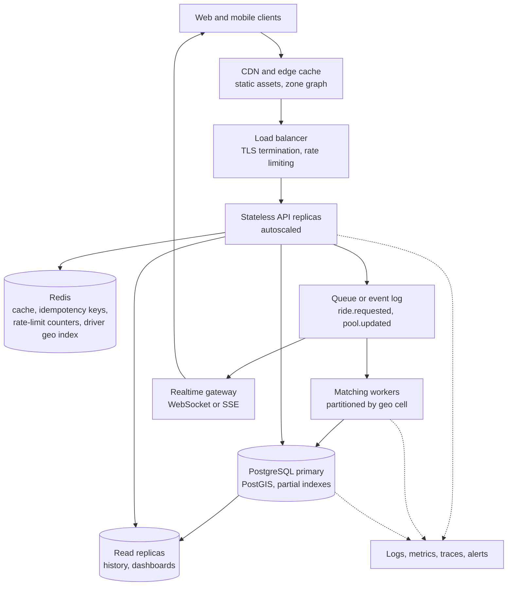
```mermaid
flowchart TB
    C["Web and mobile clients"] --> CDN["CDN and edge cache<br/>static assets, zone graph"]
    CDN --> LB["Load balancer<br/>TLS termination, rate limiting"]
    LB --> API["Stateless API replicas<br/>autoscaled"]
    API --> R[("Redis<br/>cache, idempotency keys,<br/>rate-limit counters, driver geo index")]
    API --> Q["Queue or event log<br/>ride.requested, pool.updated"]
    Q --> M["Matching workers<br/>partitioned by geo cell"]
    M --> PG[("PostgreSQL primary<br/>PostGIS, partial indexes")]
    API --> PG
    PG --> RR[("Read replicas<br/>history, dashboards")]
    API --> RR
    Q --> RT["Realtime gateway<br/>WebSocket or SSE"]
    RT --> C
    API -.-> OBS["Logs, metrics, traces, alerts"]
    M -.-> OBS
    PG -.-> OBS
```

| Concern | Today (MVP) | At 1M passengers and 100k drivers |
|---|---|---|
| **Load balancing and horizontal scaling** | One API container | Stateless API replicas behind a load balancer with autoscaling. JWT auth means no sticky sessions |
| **DB indexing and read replicas** | B-tree indexes, one database | Keep the partial and composite indexes. Send history and dashboards to read replicas. Partition ride_requests by time |
| **Caching** | None | CDN for static assets and the zone graph. Redis for hot reads such as zone lists, open groups per area, and driver dashboards, with short TTLs |
| **Geospatial search** | 10 fixed zones | PostGIS or an H3 or S2 cell index for "nearby drivers and rides". Keep live driver positions in Redis geo structures, not Postgres |
| **Queues and events** | Matching runs inside the request | Publish ride.requested to a queue. Workers match per geographic cell. Events also feed notifications and analytics |
| **Real-time communication** | Polling every 4–6 s | WebSocket or SSE gateway, with pub/sub fan-out from the event stream |
| **Rate limiting** | In-memory, auth routes only | Redis-backed limits per user, IP, and route at the gateway, with stricter limits on ride creation |
| **Idempotency** | None | Idempotency-Key on ride creation, payment, and accept, stored in Redis, so retries never duplicate |
| **Observability** | Console logs | Structured logs with request ids, metrics (matching latency, seat-conflict rate, 409 rate, queue lag), traces, and alerts on SLOs |
| **DB contention** | Row lock per pool | One writer per geo cell (queue partition). Short transactions. Advisory locks or a version column for the route update. Hot cells can be split |
| **Ride matching** | Oldest-first scan of open groups | Index groups by route corridor so matching checks only nearby, compatible groups. Score by detour and wait time |
| **Retry and failure strategy** | Fail the request | Retries with exponential backoff and jitter for idempotent operations, dead-letter queues, circuit breakers, and a clear "still searching" state for riders |
| **Security** | JWT, bcrypt, Helmet, Zod, rate limit | httpOnly cookies with rotating refresh tokens, WAF and bot protection, secret manager, least-privilege database roles, audit logs, dependency scanning |
| **Deployment strategy** | Compose, Render, Vercel | Containers on Kubernetes or a managed container service, blue/green or canary releases, migrations decoupled from deploys, multi-AZ database with automatic failover, and load tests before launch |

**Principle:** keep the PostgreSQL constraints (capacity, transitions, one active pool per vehicle) even after adding queues and caches. They are the last line of defence when everything else retries and races.

## 25. AI usage

I used **Claude** (Anthropic) throughout as a pair-programming and review partner. It was used for:

- Drafting the schema, the trigger functions, and most of the Express services, controllers, validators, and Jest tests.
- Drafting the Next.js pages, the SVG map component, and the diagrams and README structure.
- Debugging: reading stack traces from my terminal and Docker logs and proposing fixes.

I reviewed, ran, and tested everything, and I can explain each part.

**One accepted suggestion:** enforce seat capacity **in the database** with a trigger that locks the pool row (SELECT ... FOR UPDATE) before counting seats. It solves the Nusrat vs Shirin last-seat race at the lowest level, so no application bug can overbook Bullet. I accepted it after tracing what two concurrent transactions would do.

**One rejected or changed suggestion:** the first matching rule was "two rides are poolable if they share at least one road segment", after an earlier "same pickup zone" version. Testing my own examples showed that riders can share a road but come from or go to different places, so no single vehicle can serve both. I changed the rule to "all paths must merge into one line, in one direction", implemented as tryMergePath and covered by unit tests. A second change: the AI first suggested Prisma's new prisma-client generator. It emitted TypeScript that plain Node could not load, so I switched to the stable prisma-client-js generator with the pg adapter.

## 26. Author

**Moshee-Ur Rahman**, built as a submission for the RoBenDevs "Chief Tesla Engineer" challenge.

Linkedin: https://www.linkedin.com/in/mosheeurrahman/